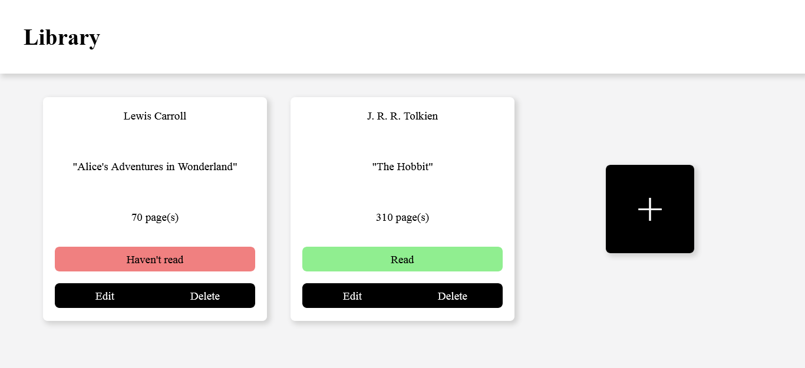
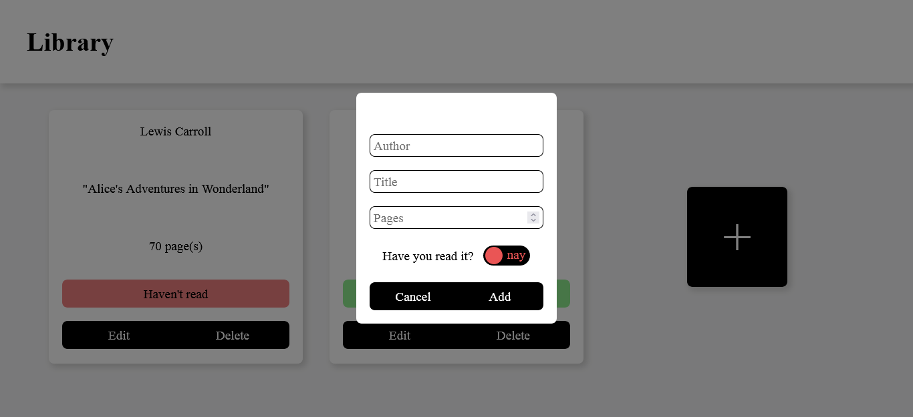
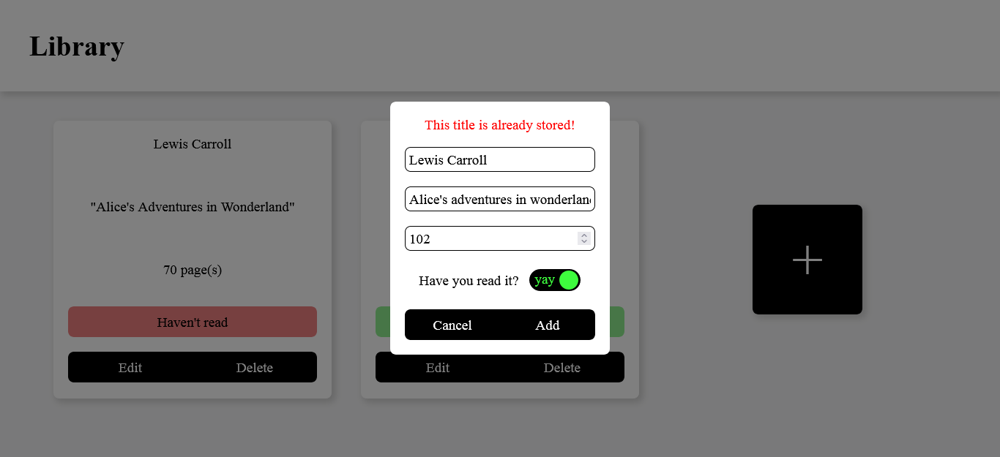

# library

A library website where you can add, edit, and delete books. The data is stored in **localStorage**.

[Try Demo](https://updatedmyjournal.github.io/library/)

## Screenshots

How it looks:

When trying to add or edit a book, a form appears:

There is also a book title validation:

